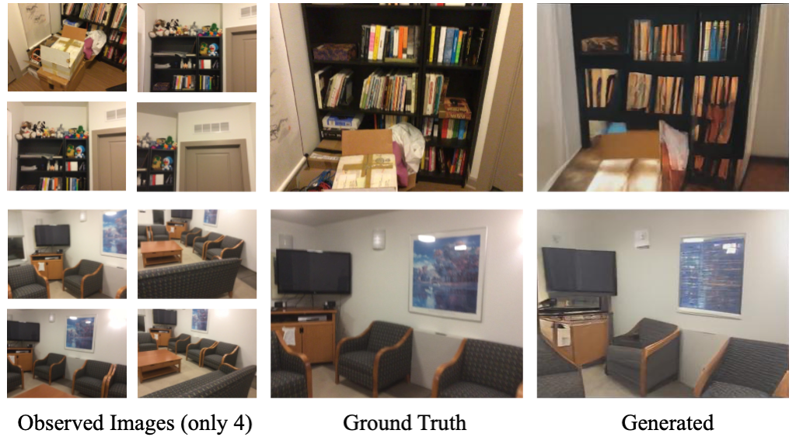

# SparseGNV: Generating Novel Views of Indoor Scenes with Sparse Input Views
### [Paper](#) | [Supplementary](#) | [Arxiv](#) </h2>

### SparseGNV generates novel view images of indoor scenes based on 4 observed views:

## Abstract
We study to generate novel views of indoor scenes given sparse input views. The challenge is to achieve both photorealism and view consistency. We present SparseGNV: a learning framework that incorporates 3D structures and image generative models to generate novel views with three modules. The first module builds a neural point cloud as underlying geometry, providing contextual information and guidance for the target novel view. The second module utilizes a transformer-based network to map the scene context and the guidance into a shared latent space and autoregressively decodes the target view in the form of discrete image tokens. The third module reconstructs the tokens into the image of the target view. SparseGNV is trained across a large indoor scene dataset to learn generalizable priors. Once trained, it can efficiently generate novel views of an unseen indoor scene in a feed-forward manner. We evaluate SparseGNV on both real-world and synthetic indoor scenes and demonstrate that it outperforms state-of-the-art methods based on either neural radiance fields or conditional image generation.

## Details
✍️ Under contruction, please check the paper first. 
